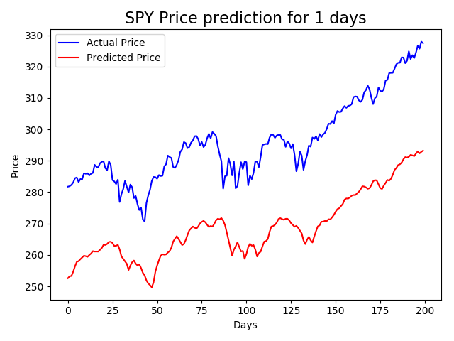

# Stockfun
Some python code as fun exploration of stock price prediction

Based on [this article](https://www.thepythoncode.com/article/stock-price-prediction-in-python-using-tensorflow-2-and-keras?fbclid=IwAR3eij453XYJ7PKNmCfnDFdLktUGlhJsp-9XtLbjCURfXACJj8PeFwyss7A)

Implements LSTM model: 

## Example:
SPY on Jan/14/2020 
* MSE: 0.0029541658914964387
* MAE: 0.05213233828544617
* Future price after 1 days is 301.65$
* Accuracy Score: 0.4963126843657817

## CUDA & GPU setup:
* Check NVDIA Driver == 418.x or higher.
* Install CUDA == 10.1 (or higher)
* Install cuDNN SDK (>= 7.6)

Links to [install instructions](https://www.tensorflow.org/install/gpu)

## Getting started:

1) Clone repo
2) Install requirements.txt: `pip install -r requirements.txt `  
3) Inspect & adjust model [parameters](src/parameters.py) 
4) Run main.py 
5) Inspect results 